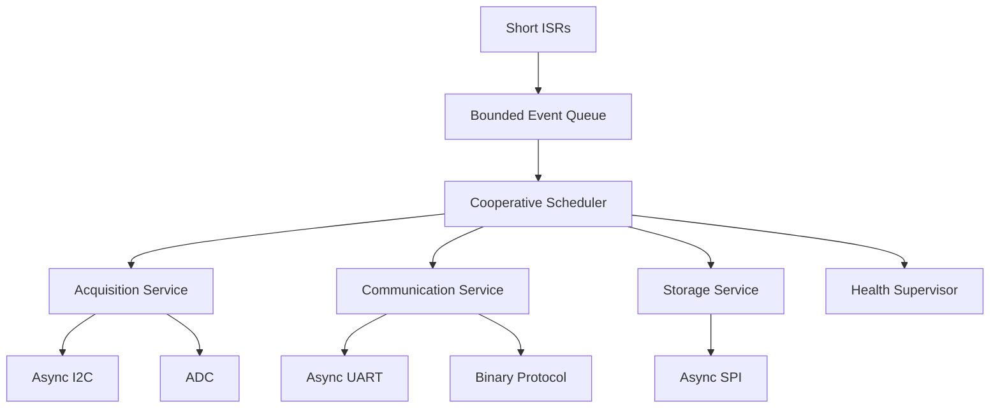

# Architecture

```mermaid
flowchart TD
  ISR[Short ISRs] --> EQ[Bounded Event Queue]
  EQ --> SCH[Cooperative Scheduler]
  SCH --> ACQ[Acquisition Service]
  SCH --> COM[Communication Service]
  SCH --> STO[Storage Service]
  ACQ --> I2C[Async I2C]
  ACQ --> ADC[ADC]
  STO --> SPI[Async SPI]
  COM --> UART[Async UART]
  COM --> PROTO[Binary Protocol]
  SCH --> HEALTH[Health Supervisor]
```

ISRs acknowledge hardware and move minimal data. State machines, parsing, storage commits, and recovery run in foreground context.
